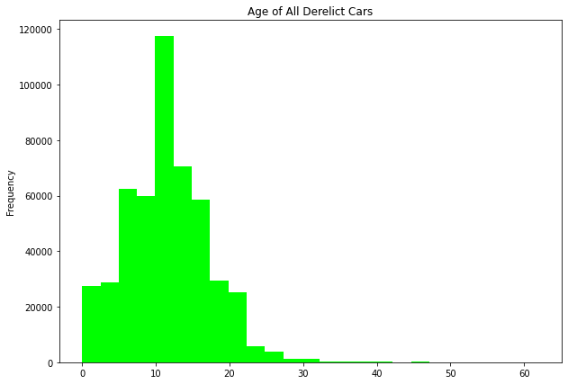

# Analysis of Derelict Vehicles in New York City

------
### Hanzhi Guo

## Motivation:

------

Everyone has seen parked, possible abandoned, vehicles on the side of the road. I have zero insights on them and they remain a mystery to me. It would be fun to dig into the data to see if there are any fun facts about them!

------

## [NYC Derelict Vehicle Dataset](https://catalog.data.gov/dataset/derelict-vehicle-dispositions-vehicles)

### Dataset Key Features:
- Manufactured year of car (1950 - 2019)
- Date and Time the car was tagged (1990 - 2019)
- Location (address of the vehicle)
- Make of car
- Color
- Indication of whether it was stolen

### Tools Used
* Pandas
* Matplotlib
* Seaborn
* Geopy (attempted)
------

## Analysis

### Physical Characteristics

Let us look at what kind of vehicles get abandoned the most.

It looks like the most abandoned vehicles are 4 door, blue, Chevys. But let's make sure by grouping all the characteristics together.

### Year Vehicle was Manufactured

Let us look at the year that the vehicles were manufactured:

There seems to be something odd with the year 1972. Most derelict vehicles were manufactured in 1972.

The most common derelict vehicles manufactured in 1972 are Chevys, Olds, Fords, and Buicks.

The most abandoned vehicles in New York City are 1979 Chevys followed by 1972 Chevys, 1978 Chevys, and 1980 Chevys!

### Are They Stolen?

Approximately 8% of the derelict vehicles have been reported as stolen.

### Age of Vehicle

We can derive the age of the vehicle by subtracting the year the vehicle was manufactured by the year the vehicle was tagged. This will show us the age of the abandoned vehicle.

We can see that there is a difference between the two graphs. It seems as though the stolen vehicles are generally newer. Can we prove that claim?

H0: There is no significant difference in the age of derelict vehicles whether it is stolen or not.

Ha: There is significant difference in the age of stolen derelict vehicles and non-stolen ones.

A good data analyst/scientist will alawys back up their claims with statistically significant testing.

### Bootstrapping the Data

#### Not Stolen Vehicle Ages Bootstrapped

#### Stolen Vehicle Ages Bootstrapped

From the bootstrapped results we can see that the mean and median age for stolen cars is 7.5 with high confidence. It is also interesting to see there is a bimodal median for the non-stolen cars at 11 and 12 thus reinforcing that the mean age for non-stolen cars centers heavily around 11.5 years old. The bootstrap is much more likely to get a whole number as the median.

Looking at the mean distribution, we see that if we were to overlay the non-stole and stolen graphs, the stolen graph would end right where the non-stolen graph would begin (nearly 0% overlap). The 95% Confidence Interval for both bootstraps show there is statistical significance in the claim that non-stolen derelict cars are generally older than stolen derelict cars.

### Vehicle Make Age Distribution

Even though Chevys, Fords, and Olds are the most abandoned vehicles, we find that Nissans and Mazdas are the newest vehicles to be abandoned. 

Here are some speculations:
- Less reliable
- Easily stolen
- People who buy them don't dislike the car sooner

### When and Where Were They Tagged?

The dataset gives us vehicles tagged between 1990 to 2019 with a whopping 82,203 peak in 1991 and a general downtrend ever since.

It appears that most derelict vehicles are tagged between the hours of 7am and 1pm and drop significantly during 2pm to 6am.

Grouping by districts, we can see that the most abandoned vehicles are found in Bronx West, Bronx East, Brooklyn North, Queens South, and so on.

## Further Consideration

I initially planned to have the locations graphed on a map but the location data is very descriptive, in address form, and contains incomplete data. I attempted to extract coordinates with geopy and OpenMaps API but the addresses were not readable and the API couldn't handle the amount of requests I needed.
